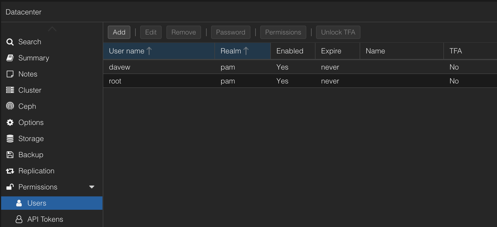
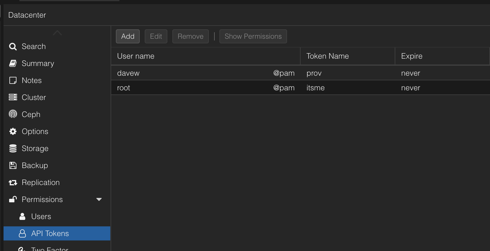
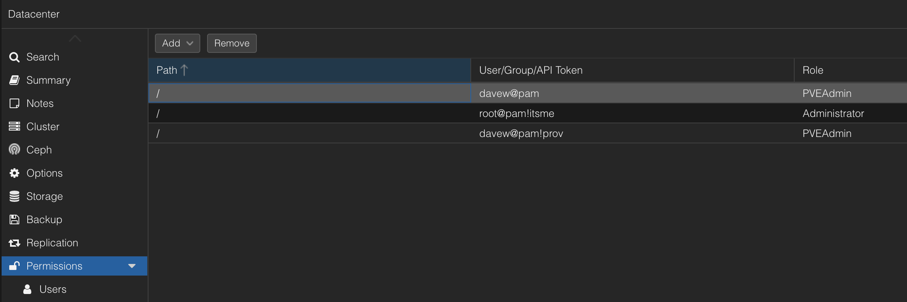

## Arcane Mage - Automated Fluxnode ArcaneOS Installation

### Introduction

This is experimental software. There may be rough edges. If you spot something that is not quite right - please open an issue.

Arcane Mage is a suite of tools designed to ease the installation (and configuration) burden of installing a Fluxnode.

The following is available via the GUI, or CLI:

* Fully automated A to Z Proxmox installs, including Secure Boot key enrollment.
* Mutlicast config broadcast on LANs - fully automated installs, except Secure Boot Key enrollement.
* USB stick creation for plug and play automated installs on bare metal

### Configuration Options

See the `examples` directory for sample configurations.

Any option can be easily set via a yaml configuration file, for example, for Proxmox, start on VM creation, rate limits, etc.

It can also reboot direct into `systemd-boot` for systems that allow easy enrollment of keys (usually bare metal systems)

### Installation

Install `uv` - https://docs.astral.sh/uv/getting-started/installation/

To run once without installing:

```bash
uvx --with arcane_mage python -m arcane_mage
```

Install as a tool:

```bash
uv tool install arcane-mage
```

To use the default config file `fluxnodes.yaml` in the directory you are in (this will run the GUI):

```bash
arcane-mage
```

Run the following for help:

```bash
arcane-mage --help
```

### Hypervisor Setup - Proxmox Automation

__MINIMUM PROXMOX VERSION: 8.4.1__

In order to use `Arcane Mage` with Proxmox, the following needs to be set up on your hypervisor:

* A user for the API
* An API token (strongly recommended)
* Nginx reverse proxy (strongly recommended)
* Storage area for DISK images needs to allow `import` content type

To set up your Proxmox Instance behind an Nginx reverse proxy, follow these instructions, it doesn't take much effort:

https://pve.proxmox.com/wiki/Web_Interface_Via_Nginx_Proxy

If you don't reverse proxy the api, you can run into connection issues.

If using the default Proxmox settings, you will need to enable the `import` option under the `Datacenter` -> `Storage` endpoint (click edit):


To set up your user, go to "Datacenter" on the Proxmox GUI and add a user:



Next, add an api token for your user:



Finally, give **BOTH** your user and api token `PVEAdmin` permissions:



**A note on using the `startup_config` parameter**

Setting a startup config for a node requires elevated permissions that the `PVEAdmin` role does not cover. The easiest way to resolve this is to create a role, I.e. `UserAdminSysModiy` with the `Sys.Modify` permission on the `/` path. You need to give this extra role to BOTH the api user and token.

You're now good to run Arcane Mage.
