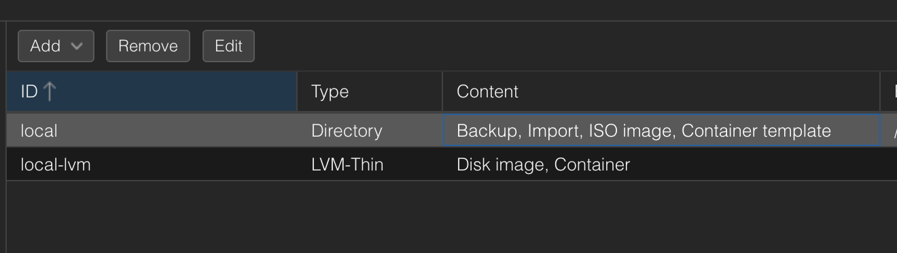
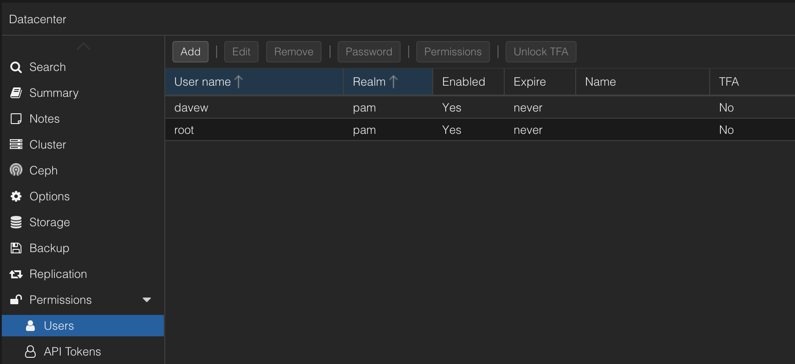
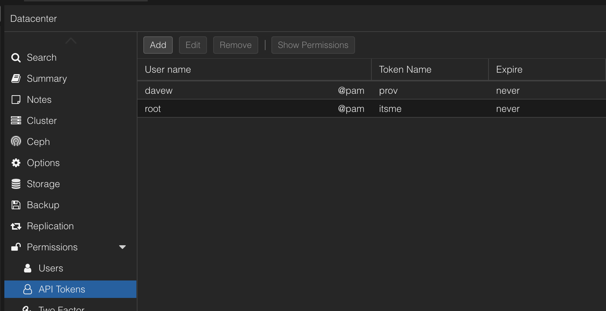
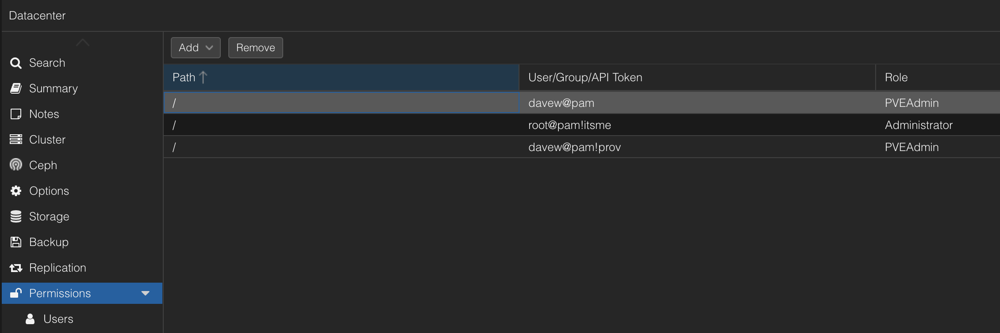

# Proxmox Setup

**Minimum Proxmox version: 8.4.1**

In order to use Arcane Mage with Proxmox, the following needs to be set up on your hypervisor:

* A user for the API
* An API token (strongly recommended)
* Nginx reverse proxy (strongly recommended)
* Storage area for disk images needs to allow `import` content type

## Nginx Reverse Proxy

To set up your Proxmox instance behind an Nginx reverse proxy, follow these instructions:

https://pve.proxmox.com/wiki/Web_Interface_Via_Nginx_Proxy

If you don't reverse proxy the API, you can run into connection issues.

## Storage Configuration

If using the default Proxmox settings, you will need to enable the `import` option under the `Datacenter` -> `Storage` endpoint (click edit):



The provisioner needs at least 10 MiB of free space on the import storage for temporary EFI and config disk images. If space is tight, you may see a storage validation error — free up space or use a `root@pam` API token which can access reserved blocks.

## User Setup

Go to "Datacenter" on the Proxmox GUI and add a user:



## API Token Setup

Add an API token for your user:



The token format is `user@pam!tokenname=tokenvalue`. Save this — you'll need it for Arcane Mage.

## Permissions

Give **BOTH** your user and API token `PVEAdmin` permissions:



### startup_config Permission

Setting a startup config for a node (e.g. `startup_config: order=4,up=360`) requires elevated permissions that the `PVEAdmin` role does not cover. To resolve this:

1. Create a custom role (e.g. `UserAdminSysModify`) with the `Sys.Modify` permission
2. Assign it on the `/` path
3. Give this role to **BOTH** the API user and token

## Verifying Your Setup

Once configured, verify connectivity with:

```bash
arcane-mage ping --url https://pve.local:8006 --token 'user@pam!tokenname=tokenvalue'
```

Or if you've already added the hypervisor via the TUI:

```bash
arcane-mage ping -H myhypervisor
```

Run a pre-flight validation to check storage, ISO, and network:

```bash
arcane-mage validate -H myhypervisor -c fluxnodes.yaml
```
